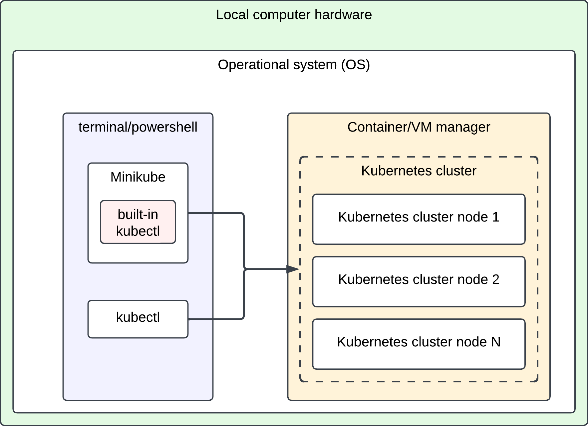
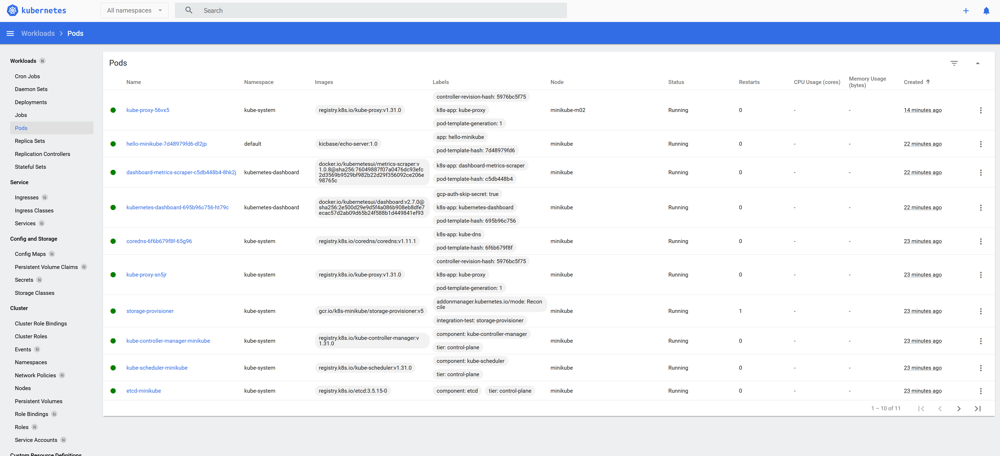

# Guide to run Kubernetes locally

This guide will help you to install and run Kubernetes locally. In summary, we will create a Kubernetes cluster with a single node using an application named Minikube. Minikube supports many containerization backend technologies, such as Docker, Hyper-V and KVM, and the choice of backend depends on the OS you're using and the tools you're more familiar with. If you don't know where to start, don't worry, this guide will also help you to install and configure everything needed to have a local kubernetes cluster up and running. Here's a diagram for an overview of the final setup.



## Pre-requisites

Before moving on, please make sure your computer have at least:

- 2 CPUs
- 2GB of free memory
- 20GB of free storage
- Internet connection
- A container/virtual machine manager

In this guide we'll be using Podman as container/vm manager because it's compatible with all OS and it has a typical installation. However, you should use what you're more confortable with. If you don't know where to start, Docker Desktop is a good option for personal use.


| Container/VM manager                       | Supported OS                            | How to install (summary)                                                                                                                          | Official documentation / more information                                                     |
| ------------------------------------------ | --------------------------------------- | ------------------------------------------------------------------------------------------------------------------------------------------------- | --------------------------------------------------------------------------------------------- |
| Docker engine                              | Linux                                   | Follow official doc to install the docker engine runtime. Then, add your linux user to the docker group                                           | https://docs.docker.com/engine/install/                                                       |
| Docker Desktop (recommended for beginners) | Windows, Mac OS and Linux               | Follow official doc ("Install Docker Desktop" button). Windows and MacOS installations are typical, but linux is more complex and has more steps. | https://docs.docker.com/desktop/ It's free for individuals but paid for enterprise customers. |
| QEMU                                       | Windows, MacOS and Linux                | Follow official doc. Typical installationinstallation procedure for all OS                                                                        | https://www.qemu.org/download/                                                                |
| Hyperkit                                   | MacOS                                   | Open a terminal and run`brew install hyperkit`                                                                                                    | https://minikube.sigs.k8s.io/docs/drivers/hyperkit/                                           |
| Hyper-V                                    | Windows                                 | Open a powershell as admin and run`Enable-WindowsOptionalFeature -Online -FeatureName Microsoft-Hyper-V -All`                                     | https://minikube.sigs.k8s.io/docs/drivers/hyperv/                                             |
| KVM                                        | Linux                                   | Follow official doc. It depends on the linux distribution and can be a complicated process                                                        | https://minikube.sigs.k8s.io/docs/drivers/kvm2/                                               |
| Podman                                     | Windows, MacOS and Linux                | Follow official doc. Typical installation procedure for all OS                                                                                    | GUI:https://podman-desktop.io/downloads CLI:https://podman.io/docs/installation               |
| Parallels                                  | MacOS                                   | Download and install the app from web                                                                                                             | https://www.parallels.com/products/desktop/trial/                                             |
| Virtualbox                                 | Windows, MacOS and Linux                | Follow official doc. On Linux it depends on the distribution and can be a complicated process                                                     | https://www.virtualbox.org/wiki/Downloads                                                     |
| VMware Fusion/Workstation                  | Windows, MacOS and Linux (undocumented) | Follow official doc. Linux doesn't have official documentation                                                                                    | https://minikube.sigs.k8s.io/docs/drivers/vmware/                                             |

# Minikube

MiniKube is an application that allow us to deploy multiple Kubernetes clusters locally. It automates tasks of a Kubernetes cluster installation and interfaces it with the container/vm manager we have available, making the kubernetes cluster creation much easier and faster than [creating it manually](https://kubernetes.io/releases/download/). [Kind](https://kind.sigs.k8s.io/docs/user/quick-start/#installation) is a similar application to Minikube, but it has a number of [know issues](https://kind.sigs.k8s.io/docs/user/known-issues/), especially when it's [using Docker Desktop on Windows and MacOS](https://kind.sigs.k8s.io/docs/user/quick-start/#settings-for-docker-desktop), which makes it more suitable to advanced users.

## Minikube installation

MiniKube installation process is slightly different depending on the OS. Open a terminal/powershell with administrative permissions and run the appropriate commands to download and install minikube in your system:

### Linux (x86-64)

```
curl -LO https://storage.googleapis.com/minikube/releases/latest/minikube-linux-amd64
```

```
sudo install minikube-linux-amd64 /usr/local/bin/minikube && rm minikube-linux-amd64
```

### MacOS (arm64 "Apple Silicon")

```
curl -LO https://storage.googleapis.com/minikube/releases/latest/minikube-darwin-arm64
```

```
sudo install minikube-darwin-arm64 /usr/local/bin/minikube
```

### Windows (x86-64)

```
New-Item -Path 'c:\' -Name 'minikube' -ItemType Directory -Force
```

```
Invoke-WebRequest -OutFile 'c:\minikube\minikube.exe' -Uri 'https://github.com/kubernetes/minikube/releases/latest/download/minikube-windows-amd64.exe' -UseBasicParsing
```

```
$oldPath = [Environment]::GetEnvironmentVariable('Path', [EnvironmentVariableTarget]::Machine)
if ($oldPath.Split(';') -inotcontains 'C:\minikube'){
  [Environment]::SetEnvironmentVariable('Path', $('{0};C:\minikube' -f $oldPath), [EnvironmentVariableTarget]::Machine)
}
```

For other options and architectures, such as MacOS Intel x86-64, please consult the [official Minikube documentation](https://minikube.sigs.k8s.io/docs/start/).

## Minikube initial setup

### Set the container/vm manager driver

Now that we installed MiniKube, we need to set the container/vm manager driver. This will define which manager MiniKube will use under the hood, so it needs to match the manager we've installed before.


| container/vm manager                       | minikube command                        |
| ------------------------------------------ | --------------------------------------- |
| Docker engine                              | `minikube config set driver docker`     |
| Docker Desktop (recommended for beginners) | `minikube config set driver docker`     |
| QEMU                                       | `minikube config set driver qemu2`      |
| Hyperkit                                   | `minikube config set driver hyperkit`   |
| Hyper-V                                    | `minikube config set driver hyperv`     |
| KVM                                        | `minikube config set driver kvm2`       |
| Podman                                     | `minikube config set driver podman`     |
| Parallels                                  | `minikube config set driver parallels`  |
| Virtualbox                                 | `minikube config set driver virtualbox` |
| VMware Fusion/Workstation                  | `minikube config set driver vmware`     |

In our example we're using Hyper-V, so we need to run:

```
minikube config set driver podman
```

### Start Minikube

Run this commands to create a local kubernetes cluster using Minikube:

```
minikube start
```

Result should be similar to:

```
😄  minikube v1.34.0 on Microsoft Windows 11 Pro 10.0.22631.4460 Build 22631.4460
✨  Using the podman (experimental) driver based on user configuration
📌  Using Podman driver with root privileges
👍  Starting "minikube" primary control-plane node in "minikube" cluster
🚜  Pulling base image v0.0.45 ...
E1123 21:40:48.538300   20780 cache.go:189] Error downloading kic artifacts:  not yet implemented, see issue #8426
🔥  Creating podman container (CPUs=2, Memory=3900MB) ...
❗  Failing to connect to https://registry.k8s.io/ from inside the minikube container
💡  To pull new external images, you may need to configure a proxy: https://minikube.sigs.k8s.io/docs/reference/networking/proxy/
🐳  Preparing Kubernetes v1.31.0 on Docker 27.2.0 ...E1123 21:41:07.748623   20780 start.go:132] Unable to get host IP: RoutableHostIPFromInside is currently only implemented for linux

    ▪ Generating certificates and keys ...
    ▪ Booting up control plane ...
    ▪ Configuring RBAC rules ...
🔗  Configuring bridge CNI (Container Networking Interface) ...
🔎  Verifying Kubernetes components...
    ▪ Using image gcr.io/k8s-minikube/storage-provisioner:v5
🌟  Enabled addons: storage-provisioner, default-storageclass
💡  kubectl not found. If you need it, try: 'minikube kubectl -- get pods -A'
🏄  Done! kubectl is now configured to use "minikube" cluster and "default" namespace by default
```

In the installation process Minikube has also added `kubectl` to our session path. This means that the cluster we just created is accessible via `kubectl` and we can send commands directly to the cluster API in this session. To verify that's the case, we can run any of these commands:

* `kubectl get nodes -o wide` shows all the nodes of the cluster with a few details
* `kubectl get pods -A` shows all pods running in all namespaces, including sytem pods
* `kubectl run pause --image=registry.k8s.io/pause:latest` creates a pod in default namespace running a custom image named 'pause'

If we are in a different session, we can use the Minikube built-in `kubectl` instead of the host OS. To do that, we simply run `minikube kubectl -- <KUBECTL ARGUMENTS>`. For the examples above, it will be:

* `minikube kubectl -- get nodes -o wide`
* `minikube kubectl -- get pods -A`
* `minikube kubectl -- run pause --image=registry.k8s.io/pause:latest`

If you're able to run kubectl commands on your minikube cluster, your kubernetes cluster was succesfully created and it's operational. Congratulations!

#### Minikube Dashboard

For a visual overview of the cluster and the workloads, we can run `minikube dashboard`. This will download and run a couple of docker images and expose an endpoint of the cluster via local proxy. After that, we can navigate access the cluster configuration in a more visual way using any modern web browser.



## Troubleshooting

Minikube application covers many different OS, container and VMs backends, so it's normal that we face a few problems. Here's a few common issues people have when setting up Minikube:

### Minikube cannot start

If you're facing errors when trying to start minikube, try to identify the message that shows where it's failing. One common mistake is to run Minikube without having a docker runtime operational. Usually this happens because:

* Docker runtime is not installed in the system
* Docker runtime is installed, but it is not running
* Docker runtime is installed, it is running but the user running Minikube is not part of docker group - so it does not have permissions to interact with the backend

For example, by default minikube uses docker backend and this example-system does not have docker or docker-desktop installed. So when trying to start minikube, the error message shows that 'docker provider' was not found:

```
😄  minikube v1.34.0 on Microsoft Windows 11 Pro 10.0.22631.4460 Build 22631.4460
✨  Using the docker driver based on user configuration

🤷  Exiting due to PROVIDER_DOCKER_NOT_FOUND: The 'docker' provider was not found: exec: "docker": executable file not found in %PATH%
💡  Suggestion: Install Docker
📘  Documentation: https://minikube.sigs.k8s.io/docs/drivers/docker/
```

To fix this issue, we can:

* Install and configure the docker runtime that is missing. If it is already installed, make sure it is running and the user executing Minikube has the right permissions
* Try a different container manager provider. Run the command `minikube start --driver=<BACKEND_PROVIDER>` using another container provider, if you manage to start to cluster this way, you can set it up as the default driver (refeer to "Set the container/vm manager driver" section of this guide)

### Dashboard never starts

If the dashboard is taking too long to start it is possible the networking layer is misconfigured. Unfortunately this is most likely related to the backend manager and configuration varies a lot between providers. A docker manager running in Linux is the native and less complex setup. Hyper-V running on Windows can have some problems in multi nodes clusters, while Podman using WSL2 works fine as long as runner VM network is not shared with host. If this happens to you, consider the official provider documentation about network or changing the provider backend when possible.
